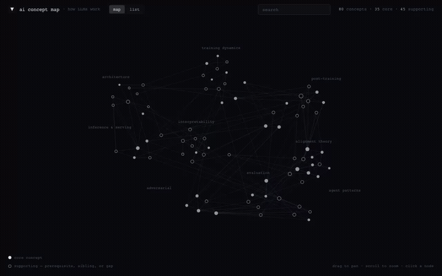
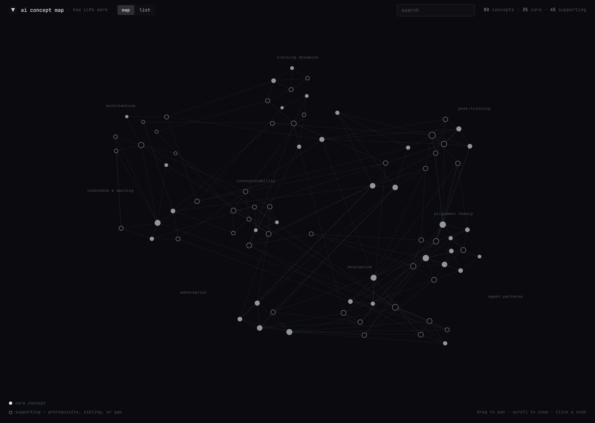
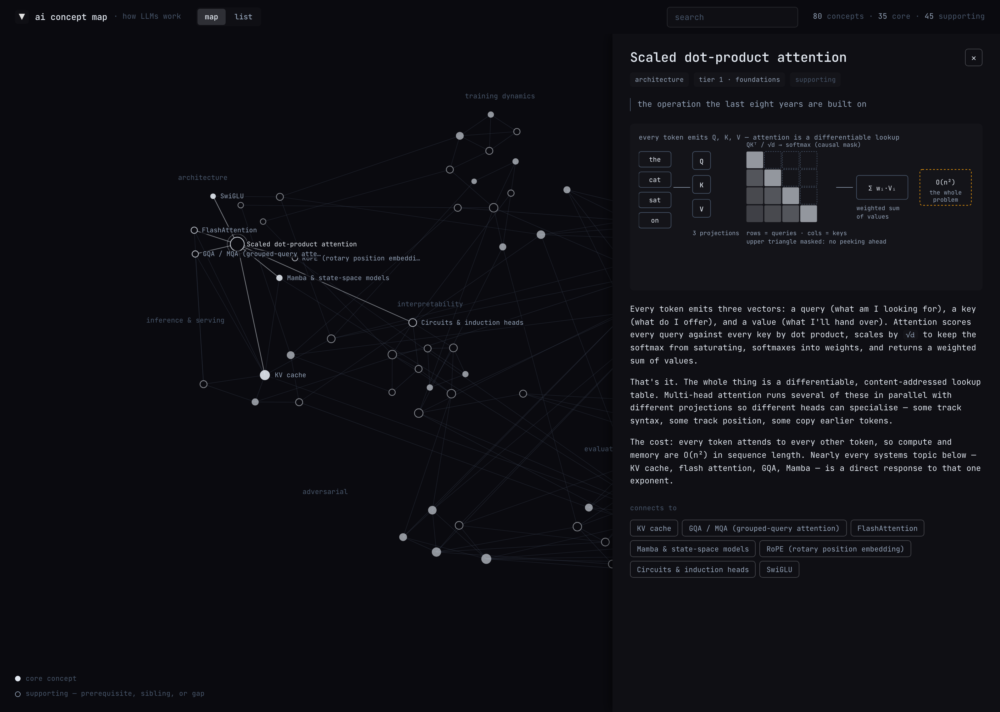
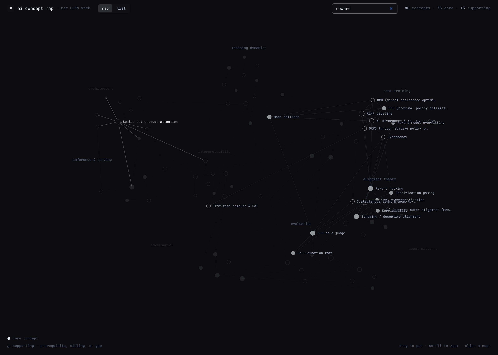
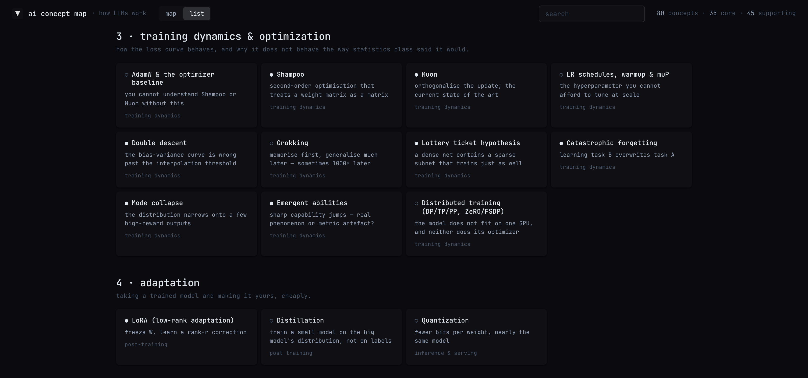

<div align="center">

# AI Concept Map

**The 80 concepts you need to actually understand how modern LLMs work — laid out as a graph of prerequisites, not a flat glossary.**


</div>



<table>
<tr>
<td width="50%"><br><em>The whole field at once — 80 concepts, nine clusters</em></td>
<td width="50%"><br><em>Click a node for a diagram, the prose, and what it connects to</em></td>
</tr>
<tr>
<td width="50%"><br><em>Search narrows 80 concepts to one thread</em></td>
<td width="50%"><br><em>List view — the same concepts as a linear reading path</em></td>
</tr>
</table>

## Why you'll like it

- **It tells you what to learn first.** Every concept links to the ones underneath it, so you can drop into any node and walk backwards until you hit something you already know.
- **It's honest about what's unsettled.** Entries carry their real 2025 status — where SAEs underperform, where a result is contested — not a tidy summary that pretends the field agreed.
- **71 of the 80 concepts have a hand-drawn diagram**, because attention, KV caching, and MoE routing are geometry problems wearing a text disguise.
- **Nothing to install.** One HTML file, no build step, no dependencies, no server, no network calls.

## Quick start

```bash
git clone https://github.com/MattModeCode/ai-concept-map.git
cd ai-concept-map
open index.html
```

Or just open [`index.html`](index.html) in any modern browser.

> [!TIP]
> Hosting it is equally simple — drop `index.html` on GitHub Pages, Netlify, or any static host. There is nothing to build.

## Using it

| Action | Result |
| --- | --- |
| Drag | Pan the canvas |
| Scroll | Zoom — past a point, every node shows its label |
| Click a node | Open its detail panel |
| `Esc` | Close the panel |
| `map` / `list` | Switch between the graph and a linear reading path |
| Search | Filter the graph to matching concepts |

Filled nodes are core concepts. Ringed nodes are supporting ones — a prerequisite, a sibling worth knowing, or an outright gap.

**List view** is the same 80 concepts flattened into tier order — the recommended path if you're starting from scratch. Start at the top even if the later tiers are what you came for; a good half of the alignment material stops making sense without the training and interpretability tiers under it.

## What's covered

Eleven tiers, roughly in dependency order:

1. **Foundations** — tokenization, cross-entropy, attention, the residual stream, logits, sampling, scaling laws
2. **Modern architecture** — RoPE, RMSNorm, SwiGLU, GQA/MQA, FlashAttention, MoE, state-space models
3. **Training dynamics** — AdamW, Shampoo, Muon, LR schedules and muP, double descent, grokking
4. **Adaptation** — taking a trained model and making it yours, cheaply
5. **Post-training & RL** — where a text predictor becomes an assistant, and where most alignment failures are born
6. **Inference & serving** — the half of the field that is about memory bandwidth, not intelligence
7. **Interpretability** — reading the model rather than testing it
8. **Alignment theory** — arguments mostly older than LLMs, now getting empirical results attached
9. **Evaluation** — how you know anything, and the reasons you might not
10. **Adversarial & security** — the failure modes with an attacker attached
11. **Agent patterns** — what happens when the loop closes and the model can act

<details>
<summary><strong>How it works, and how to add a concept</strong></summary>

<br>

Everything lives in [`index.html`](index.html) — content, force-directed layout, canvas renderer, and styles.

- **Data layer** — a single `C` array of concept objects (`id`, `name`, `cat`, `tier`, `one`, `body`, `links`, `diagram`), plus `CATS` and `TIERS` lookup tables.
- **Layout** — a small force simulation seeds nodes near their category anchor, then relaxes edge springs and node repulsion into a stable arrangement.
- **Rendering** — plain Canvas 2D with manual pan/zoom transforms. No graph library.

To add a concept, append an object to the `C` array:

```js
{ id:'speculative', name:'Speculative decoding', cat:'infer', tier:6, yours:false,
  one:'a small model drafts, a big model checks',
  body:`...`,
  links:['kvcache','sampling'], diagram:null },
```

Links are bidirectional — listing `kvcache` here draws the edge from both sides. The node count in the header updates itself.

</details>

## Accessibility

Keyboard-navigable controls with visible focus rings, ARIA labelling on the view toggle, search, and detail panel, and a list view that works as a full text alternative to the canvas.
